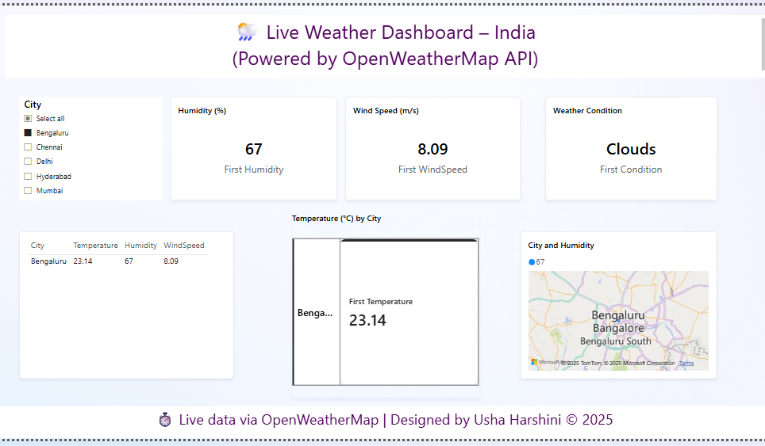

 Live Weather Dashboard – Power BI

A real-time weather dashboard built in "Power BI" using the "OpenWeatherMap API", visualizing live temperature, humidity, and wind data across major Indian cities.

 Features

- Live weather API integration  
- Cities: Hyderabad, Chennai, Bangalore, Mumbai, Delhi  
- Interactive map + multi-row cards (no bar/pie charts)  
- Custom theme and clean layout

Tools Used

- Power BI Desktop  
- Power Query (M language)  
- OpenWeatherMap API

Files

- `LiveWeatherDashboard.pbix` – Power BI file  
- `Screenshot 2025-07-03 230305.png` – Dashboard preview  
- `README.md` – Project overview

